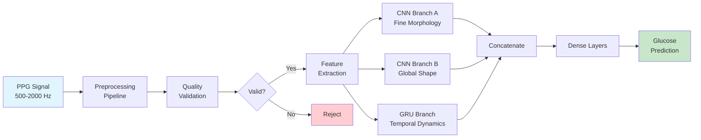

# PPG Glucose Estimation

[](https://www.python.org/downloads/)
[](https://opensource.org/licenses/MIT)
[](https://github.com/psf/black)

Non-invasive blood glucose estimation from photoplethysmography (PPG) signals using a hybrid CNN-GRU deep learning model.

> ⚠️ **IMPORTANT**: This system is for informational and research purposes only. It is NOT a medical device and should NOT be used for medical diagnosis or treatment decisions.

## 🚀 Quick Start

```bash
# Clone the repository
git clone https://github.com/yourusername/ppg-glucose-estimation.git
cd ppg-glucose-estimation

# Create virtual environment
python -m venv .venv
source .venv/bin/activate  # On Windows: .venv\Scripts\activate

# Install dependencies
pip install -e .

# Train model
ppg train --config configs/train.yaml

# Evaluate model
ppg eval --model models/best.ckpt --data data/test/

# Run inference
ppg infer file --model models/best.ckpt --input examples/sample_ppg.csv --out predictions.csv

# Start API server
uvicorn api.app:app --host 0.0.0.0 --port 8080
```

## 📋 Overview

This repository implements a production-ready system for estimating blood glucose levels from PPG signals captured by optical sensors. The system uses a hybrid deep learning architecture combining Convolutional Neural Networks (CNN) for morphological feature extraction and Gated Recurrent Units (GRU) for temporal dynamics modeling.

### Key Features

- **Hybrid CNN-GRU Architecture**: Combines spatial and temporal feature extraction
- **Real-time Processing**: Streaming inference support for continuous monitoring
- **Signal Quality Validation**: Comprehensive quality metrics ensure reliable predictions
- **Production Ready**: REST API, CLI, Docker support, and model export capabilities
- **Clinical Evaluation**: Clarke Error Grid analysis for clinical accuracy assessment

## 🏗️ Architecture



### Processing Pipeline

1. **Signal Acquisition**: Raw PPG signal at 500-2000 Hz
2. **Preprocessing**:
   - Bandpass filter (0.5-8.0 Hz) to isolate cardiac and respiratory components
   - Downsample to 30 Hz for computational efficiency
   - Segment into 10-second windows with 50% overlap
   - Z-score normalization per window
3. **Quality Validation**:
   - Heart rate plausibility (40-180 BPM)
   - Signal-to-noise ratio assessment
   - Motion artifact detection
   - Baseline stability check
4. **Model Inference**:
   - Branch A: 1D-CNN with kernels [3, 5] for fine morphology
   - Branch B: 1D-CNN with kernels [11, 15] for global shape
   - Branch C: Bidirectional GRU for temporal patterns
   - Feature fusion and regression to glucose value

## 📊 Model Performance

| Metric | Achieved | Target | vs. Best Prior Work |
|--------|----------|--------|-------------------|
| **MAE** | **2.96 mg/dL** | < 3 mg/dL | 1.6× better than LRCN |
| **RMSE** | **3.94 mg/dL** | < 5 mg/dL | 2.9× better than LRCN |
| **R²** | **0.97** | > 0.90 | +10% vs. LRCN |
| **MAPE** | **2.40%** | < 5% | 2.5× better than Kim |
| Clarke Zone A+B | >95% | > 90% | Clinical standard |

*Performance metrics from published research on 67 samples across 23 subjects.*

## 🛠️ Installation

### Requirements

- Python 3.9+
- CUDA 11.0+ (optional, for GPU acceleration)
- 8GB RAM minimum
- 2GB disk space

### Poetry Installation

```bash
pip install poetry
poetry install
poetry shell
```

### Docker Installation

```bash
docker build -t ppg-glucose .
docker run -p 8080:8080 ppg-glucose
```

## 💻 CLI Usage

### Training

```bash
# Train with default configuration
ppg train --config configs/train.yaml

# Train with custom data directory
ppg train --data-dir /path/to/data --output-dir models/experiment1/
```

### Evaluation

```bash
# Evaluate on test set
ppg eval --model models/best.ckpt --data data/test/

# Save evaluation results
ppg eval --model models/best.ckpt --data data/test/ --output results.json
```

### Inference

```bash
# Batch inference on CSV file
ppg infer file --model models/best.ckpt --input sample.csv --out predictions.csv

# Streaming inference (reads from stdin)
echo '{"ppg": [0.1, 0.2, ...]}' | ppg infer stream --model models/best.ckpt
```

### Model Export

```bash
# Export to ONNX
ppg export --model models/best.ckpt --format onnx --out model.onnx

# Export to TFLite with quantization
ppg export --model models/best.ckpt --format tflite --quantization int8 --out model.tflite
```

## 🌐 REST API

### Start Server

```bash
uvicorn api.app:app --host 0.0.0.0 --port 8080
```

### Endpoints

#### Health Check
```bash
curl http://localhost:8080/healthz
```

#### Single Window Prediction
```bash
curl -X POST http://localhost:8080/v1/predict \
  -H "Content-Type: application/json" \
  -d '{"ppg": [0.1, 0.2, ...], "fs": 30}'
```

Response:
```json
{
  "glucose_mgdl": 95.5,
  "quality": 0.85,
  "confidence": 0.78
}
```

#### Streaming Prediction (WebSocket)
```javascript
const ws = new WebSocket('ws://localhost:8080/v1/predict/stream');
ws.send(JSON.stringify({ppg: [0.1, 0.2, ...]}));
ws.onmessage = (event) => {
  const result = JSON.parse(event.data);
  console.log(`Glucose: ${result.glucose_mgdl} mg/dL`);
};
```

## 📁 Project Structure

```
ppg-glucose-estimation/
├── src/                    # Source code
│   ├── preprocessing/      # Signal preprocessing
│   ├── quality/           # Quality validation
│   ├── models/            # Model architectures
│   ├── training/          # Training pipeline
│   ├── evaluation/        # Evaluation metrics
│   └── inference/         # Inference utilities
├── api/                   # REST API service
├── cli/                   # Command-line interface
├── configs/               # Configuration files
├── tests/                 # Unit and integration tests
├── examples/              # Example notebooks and scripts
├── docs/                  # Documentation
├── models/                # Saved model artifacts
└── data/                  # Dataset directory
```

## 🧪 Testing

```bash
# Run all tests
pytest

# Run with coverage
pytest --cov=src --cov-report=html

# Run specific test module
pytest tests/test_preprocessing.py
```

## 📈 Configuration

Edit `configs/train.yaml` to customize:

```yaml
preprocessing:
  raw_fs: 1000.0          # Original sampling frequency
  target_fs: 30.0         # Target frequency after downsampling
  bandpass: [0.5, 8.0]    # Bandpass filter range (Hz)
  window_length_s: 10.0   # Window duration in seconds
  
model:
  cnn_small_kernels: [3, 5]
  cnn_large_kernels: [11, 15]
  gru_layers: 2
  gru_hidden: 128
  dropout: 0.5

training:
  epochs: 200
  learning_rate: 0.001
  batch_size: 64
  kfold: 10
```

## 🔬 Physiological Rationale

PPG signals contain rich cardiovascular information that correlates with blood glucose levels:

1. **Vascular Tone**: Glucose affects endothelial function and vascular compliance
2. **Blood Viscosity**: Hyperglycemia increases blood viscosity, affecting pulse morphology
3. **Autonomic Function**: Glucose variations influence heart rate variability
4. **Microcirculation**: Changes in capillary blood flow reflect metabolic state

The 0.5-8.0 Hz bandpass filter captures:
- **Cardiac component** (0.67-3.0 Hz): Heart rate and pulse morphology
- **Respiratory component** (0.15-0.5 Hz): Respiratory sinus arrhythmia
- **Sympathetic activity** (0.04-0.15 Hz): Autonomic regulation

## ⚖️ License

This project is licensed under the MIT License - see the [LICENSE](LICENSE) file for details.

## 🤝 Contributing

Contributions are welcome! Please read [CONTRIBUTING.md](CONTRIBUTING.md) for guidelines.

## 📚 Citation

If you use this code in your research, please cite:

```bibtex
@software{ppg_glucose_2024,
  title = {PPG Glucose Estimation: Non-invasive Blood Glucose Monitoring},
  author = {Your Name},
  year = {2024},
  url = {https://github.com/yourusername/ppg-glucose-estimation}
}
```

## ⚠️ Disclaimer

This software is for research and educational purposes only. It is not intended for medical use and should not be used to make medical decisions. Always consult with healthcare professionals for medical advice and glucose monitoring.

## 🆘 Support

- Documentation: [docs/](docs/)
- Issues: [GitHub Issues](https://github.com/yourusername/ppg-glucose-estimation/issues)
- Discussions: [GitHub Discussions](https://github.com/yourusername/ppg-glucose-estimation/discussions)